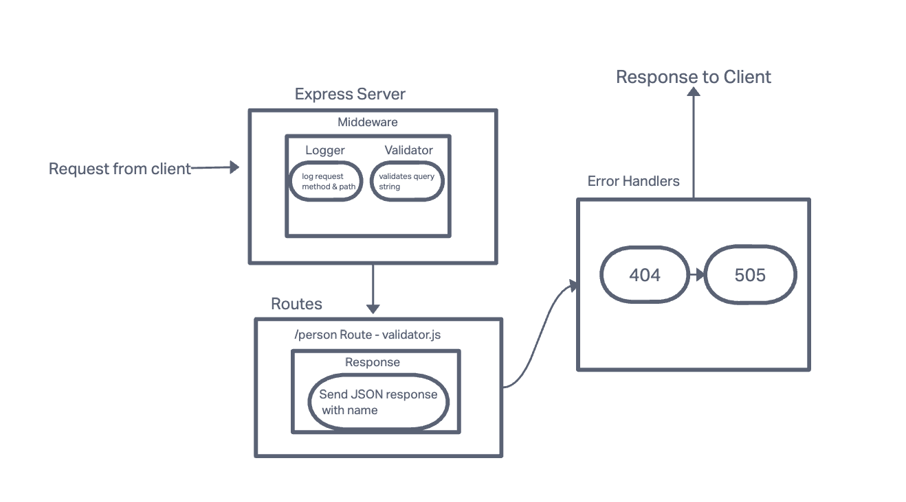

# Basic Express Server

Dynamic API Phase 1: Build your core, standards compliant Express server

## Installation

npm install

## Usage

Method: GET

Path: /person

    - Expects a query string from the user with a “name” property

    - When present, output JSON to the client with this shape: { name: "name provided" }

    - Without a name in the query string, force a “500” error

## UML

## Deployed URL

<https://express-server-0ou4.onrender.com>

## Collaborators

Jacob Knaack, Chat GPT
